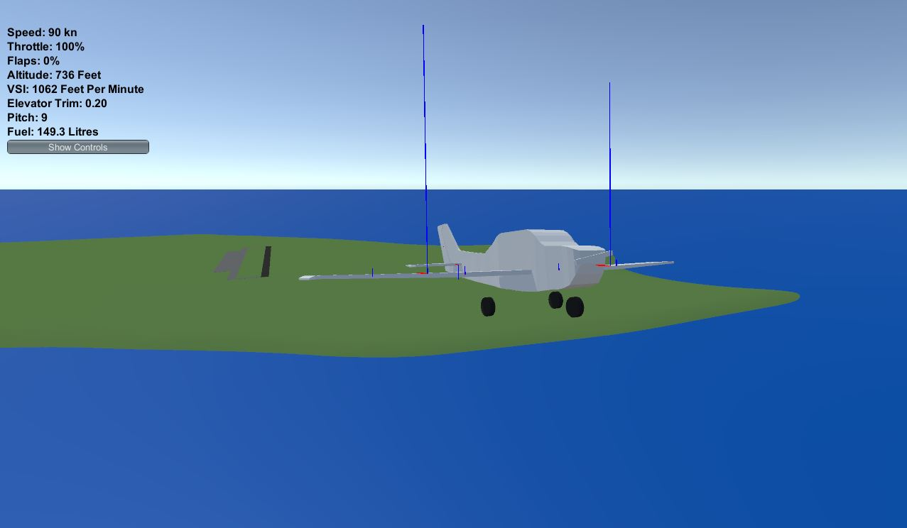

# RJ-Vehicle-Simulator
 A simple vehicle simulator made in unity3D.

### Features
- A simple airplane with semi-realistic flight characteristics.

# Table of Contents
1. [Setup](#Setup)
2. [Roadmap](#Roadmap)
3. [Contributing](#Contributing)
4. [References and Credits](#References-and-Credits)

## Setup
Install Unity3D 2021.3.25f1 and clone the project. Open the project by opening the root repository folder in unity hub.
You might need to add the Yaw Axis to the unity input manager settings.
## Roadmap
- [x] A simple airplane with mouse and keyboard controls.
- [x] Reasonably realistic flight characteristics for vehicles.
- [x] A simple boat with mouse and keyboard controls.
- [x] Reasonably realistic vehicle buoyancy characteristics.
- [x] A simple car with with mouse and keyboard controls.
- [x] Simple Environment Wind simulation.

## Contributing
Roadmap items are being developed, if you would like to contribute create a pull request and document your changes well.

## References and Credits
1. https://github.com/brihernandez/SimpleWings