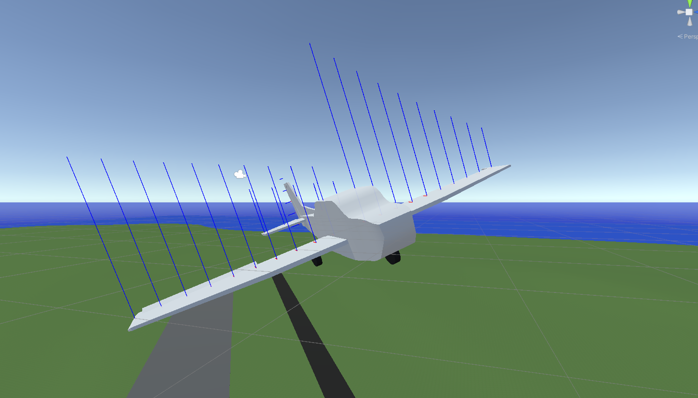

# RJ-Vehicle-Simulator
 A simple vehicle simulator made in unity3D.

### Features
- A simple airplane with semi-realistic flight characteristics.
- A simple fixed wing aircraft autopilot.
- Global wind simulation for wings.

# Table of Contents
1. [Setup](#Setup)
2. [Roadmap](#Roadmap)
3. [Contributing](#Contributing)
4. [References and Credits](#References-and-Credits)

## Setup
Install Unity3D 2021.3.25f1 and clone the project. Open the project by opening the root repository folder in unity hub.
You might need to add the Yaw Axis to the unity input manager settings.
## Roadmap
- [x] An airplane with mouse and keyboard controls.
- [x] A fixed wing aircraft autopilot.
- [x] A boat with keyboard controls.
- [x] A car with with keyboard controls.
- [x] Environment Wind simulation.
- [ ] TBD

## Contributing
Roadmap items are being developed, if you would like to contribute create a pull request and document your changes well.
Feel free to join the project discord server: https://discord.gg/xqyUMMPGdG

## References and Credits
1. https://github.com/brihernandez/SimpleWings